---
## Front matter
title: "Шаблон отчёта по лабораторной работе 06"
subtitle: "Простейший вариант"
author: "Абдуллахи шугофа"

## Generic otions
lang: ru-RU
toc-title: "Содержание"

## Bibliography
bibliography: bib/cite.bib
csl: pandoc/csl/gost-r-7-0-5-2008-numeric.csl

## Pdf output format
toc: true # Table of contents
toc-depth: 2
lof: true # List of figures
lot: true # List of tables
fontsize: 12pt
linestretch: 1.5
papersize: a4
documentclass: scrreprt
## I18n polyglossia
polyglossia-lang:
  name: russian
  options:
	- spelling=modern
	- babelshorthands=true
polyglossia-otherlangs:
  name: english
## I18n babel
babel-lang: russian
babel-otherlangs: english
## Fonts
mainfont: PT Serif
romanfont: PT Serif
sansfont: PT Sans
monofont: PT Mono
mainfontoptions: Ligatures=TeX
romanfontoptions: Ligatures=TeX
sansfontoptions: Ligatures=TeX,Scale=MatchLowercase
monofontoptions: Scale=MatchLowercase,Scale=0.9
## Biblatex
biblatex: true
biblio-style: "gost-numeric"
biblatexoptions:
  - parentracker=true
  - backend=biber
  - hyperref=auto
  - language=auto
  - autolang=other*
  - citestyle=gost-numeric
## Pandoc-crossref LaTeX customization
figureTitle: "Рис."
tableTitle: "Таблица"
listingTitle: "Листинг"
lofTitle: "Список иллюстраций"
lotTitle: "Список таблиц"
lolTitle: "Листинги"
## Misc options
indent: true
header-includes:
  - \usepackage{indentfirst}
  - \usepackage{float} # keep figures where there are in the text
  - \floatplacement{figure}{H} # keep figures where there are in the text
---

# Цель работы
Освоение арифметических инструкций языка ассемблера NASM.

# Порядок выполнения лабораторной работы

 No 1:  Символьные и численные данные в NASM

1.1: Создайте каталог для программам лабораторной работы No 6, перейдите в него и
создайте файл lab6-1.asm:

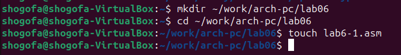{#fig:fig1 width=70% }

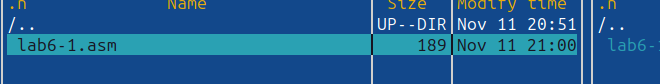{#fig:fig1 width=70% }

1.2: Листинг 6.1. Программа вывода значения регистра eax

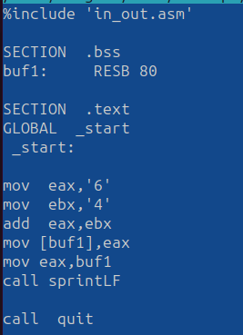{#fig:fig1 width=70% }

Создайте исполняемый файл и запустите его.

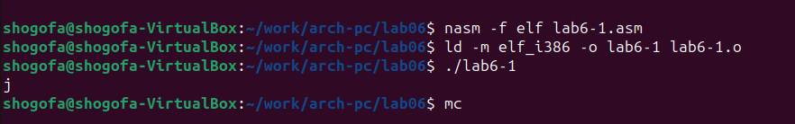{#fig:fig1 width=70% }

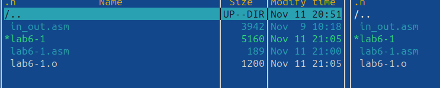{#fig:fig1 width=70% }

1.3: Далее изменим текст программы и вместо символов, запишем в регистры числа. Ис-
правьте текст программы (Листинг 6.1) следующим образом: замените строки

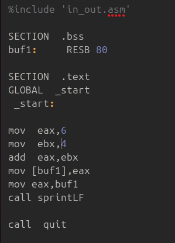{#fig:fig1 width=70% }

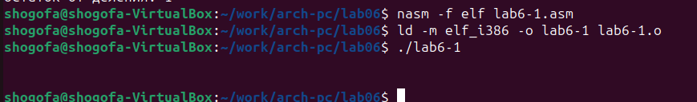{#fig:fig1 width=70% }

1.4: Как отмечалось выше, для работы с числами в файле in_out.asm реализованы подпро-
граммы для преобразования ASCII символов в числа и обратно. Преобразуем текст
программы из Листинга 6.1 с использованием этих функций.

Создайте файл lab6-2.asm в каталоге ~/work/arch-pc/lab06 и введите в него текст про-
граммы из листинга 6.2.

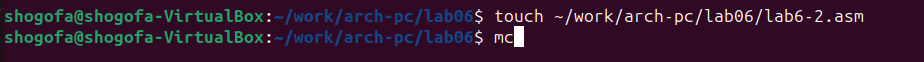{#fig:fig1 width=70% }

2.  Листинг 6.2. Программа вывода значения регистра eax 

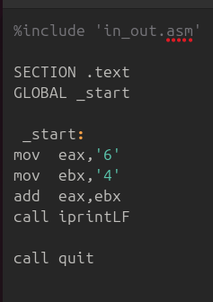{#fig:fig1 width=70% }

Создайте исполняемый файл и запустите его

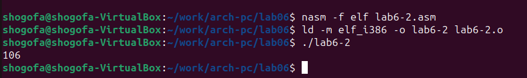{#fig:fig1 width=70% }

2.1: Аналогично предыдущему примеру изменим символы на числа. Замените строки

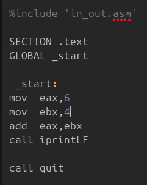{#fig:fig1 width=70% }

2.2: Создайте исполняемый файл и запустите его. Какой результат будет получен при исполне-
нии программы?

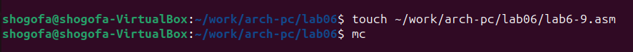{#fig:fig1 width=70% }

Замените функцию iprintLF на iprint. Создайте исполняемый файл и запустите его. Чем
отличается вывод функций iprintLF и iprint?

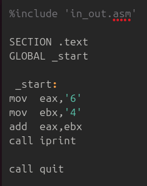{#fig:fig1 width=70% }

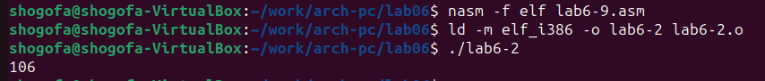{#fig:fig1 width=70% }

No 2: Выполнение арифметических операций в NASM

2.1: В качестве примера выполнения арифметических операций в NASM приведем про-
грамму вычисления арифметического выражения 𝑓(𝑥) = (5 ∗ 2 + 3)/3.

Создайте файл lab6-3.asm в каталоге ~/work/arch-pc/lab06:
2.6 Задание 6:

{#fig:fig1 width=70% }

Внимательно изучите текст программы из листинга 6.3 и введите в lab6-3.asm.

3. Листинг 6.3. Программа вычисления выражения 𝑓(𝑥) = (5 ∗ 2 + 3)/3

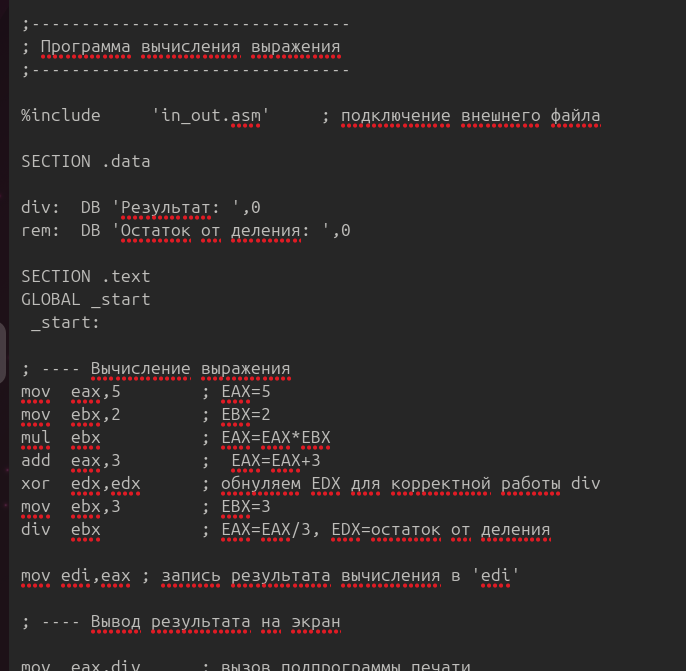{#fig:fig1 width=70% }

Создайте исполняемый файл и запустите его. Результат работы программы должен быть
следующим:

user@dk4n31:~$ ./lab6-3
Результат: 4
Остаток от деления: 1
user@dk4n31:~$

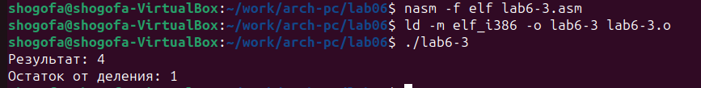{#fig:fig1 width=70% }

Измените текст программы для вычисления выражения 𝑓(𝑥) = (4 ∗ 6 + 2)/5. Создайте
исполняемый файл и проверьте его работу.

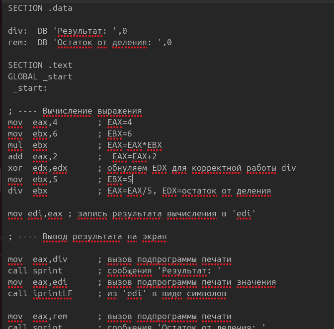{#fig:fig1 width=70% }

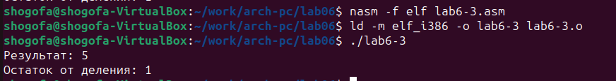{#fig:fig1 width=70% }

3.1: Создайте файл variant.asm в каталоге ~/work/arch-pc/lab06:

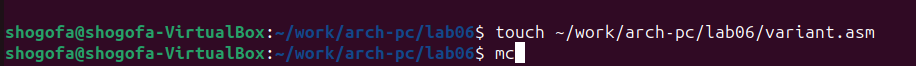{#fig:fig1 width=70% }

{#fig:fig1 width=70% }

Внимательно изучите текст программы из листинга 6.4 и введите в файл variant.asm.

4. Листинг 6.4. Программа вычисления вычисления варианта задания по номеру
студенческого билета

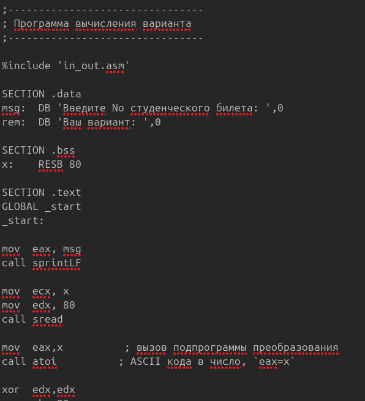{#fig:fig1 width=70% }

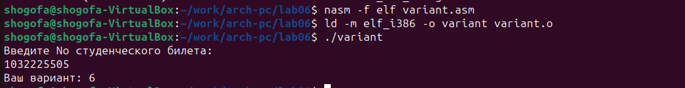{#fig:fig1 width=70% }

Создайте исполняемый файл и запустите его. Проверьте результат работы программы
вычислив номер варианта аналитически.

Включите в отчет по выполнению лабораторной работы ответы на следующие вопросы:

1. Какие строки листинга 6.4 отвечают за вывод на экран сообщения ‘Ваш вариант:’?

Строка mov eax, rem и строка call sprint отвечают за вывод на экран сообщения "мой вариант:".

2. Для чего используется следующие инструкции?
mov ecx, x
mov edx, 80
call sread

Инструкции mov ecx, x и mov edx, 80 используются для подготовки аргументов перед вызовом подпрограммы sread. mov ecx, x загружает адрес переменной x в регистр ecx, который будет использован в качестве аргумента для функции sread. mov edx, 80 загружает значение 80 в регистр edx, указывая функции sread, сколько байт нужно прочитать.

3. Для чего используется инструкция “call atoi”?

Инструкция call atoi используется для вызова подпрограммы atoi, которая преобразует ASCII-код, хранящийся в регистре eax, в число. Результат преобразования сохраняется в регистре eax.

4. Какие строки листинга 6.4 отвечают за вычисления варианта?

Строка xor edx, edx и строка mov ebx, 20 отвечают за подготовку значений перед выполнением вычислений варианта. xor edx, edx устанавливает регистр edx в ноль, а mov ebx, 20 загружает значение 20 в регистр ebx, которое будет использовано для деления.

5. В какой регистр записывается остаток от деления при выполнении инструкции “div ebx”?

Остаток от деления при выполнении инструкции div ebx записывается в регистр edx.

6. Для чего используется инструкция “inc edx”?

Инструкция inc edx используется для увеличения значения в регистре edx на единицу. В данном случае, она увеличивает значение остатка от деления на 1.

7. Какие строки листинга 6.4 отвечают за вывод на экран результата вычислений?

Строка mov eax, edx и строка call iprintLF отвечают за вывод на экран результата вычислений. mov eax, edx загружает значение в регистр eax, чтобы передать его в функцию iprintLF, которая выводит значение на экран с новой строкой.

4. Задание для самостоятельной работы

Написать программу вычисления выражения 𝑦 = 𝑓(𝑥). Программа должна выводить
выражение для вычисления, выводить запрос на ввод значения 𝑥, вычислять задан-
ное выражение в зависимости от введенного 𝑥, выводить результат вычислений. Вид
функции 𝑓(𝑥) выбрать из таблицы 6.3 вариантов заданий в соответствии с номером
полученным при выполнении лабораторной работы. Создайте исполняемый файл и
проверьте его работу для значений 𝑥1 и 𝑥2 из 6.3

{#fig:fig1 width=70% }

{#fig:fig1 width=70% }

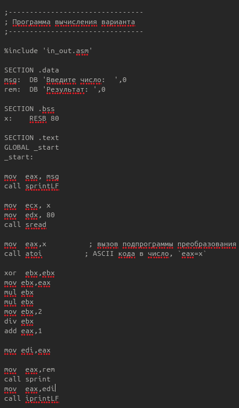{#fig:fig1 width=70% }

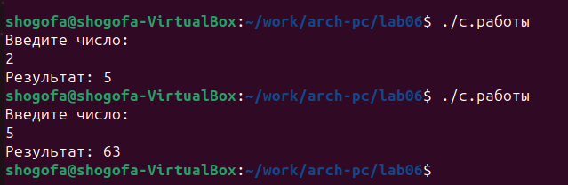{#fig:fig1 width=70% }

# Теоретическое введение

Здесь описываются теоретические аспекты, связанные с выполнением работы.

Например, в табл. @tbl:std-dir приведено краткое описание стандартных каталогов Unix.

: Описание некоторых каталогов файловой системы GNU Linux {#tbl:std-dir}

| Имя каталога | Описание каталога                                                                                                          |
|--------------|----------------------------------------------------------------------------------------------------------------------------|
| `/`          | Корневая директория, содержащая всю файловую                                                                               |
| `/bin `      | Основные системные утилиты, необходимые как в однопользовательском режиме, так и при обычной работе всем пользователям     |
| `/etc`       | Общесистемные конфигурационные файлы и файлы конфигурации установленных программ                                           |
| `/home`      | Содержит домашние директории пользователей, которые, в свою очередь, содержат персональные настройки и данные пользователя |
| `/media`     | Точки монтирования для сменных носителей                                                                                   |
| `/root`      | Домашняя директория пользователя  `root`                                                                                   |
| `/tmp`       | Временные файлы                                                                                                            |
| `/usr`       | Вторичная иерархия для данных пользователя                                                                                 |

Более подробно об Unix см. в [@gnu-doc:bash;@newham:2005:bash;@zarrelli:2017:bash;@robbins:2013:bash;@tannenbaum:arch-pc:ru;@tannenbaum:modern-os:ru].

Выполнение лабораторной работы

Описываются проведённые действия, в качестве иллюстрации даётся ссылка на иллюстрацию (рис. @fig:001).

{#fig:001 width=70%}

# Выводы

Здесь кратко описываются итоги проделанной работы.

# Список литературы{.unnumbered}

::: {#refs}
:::
